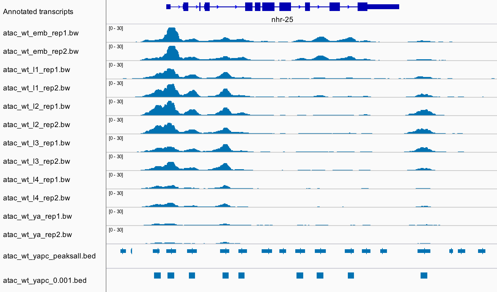

## Yet another peak caller

This is a peak caller for genomic high-throughput sequencing data such as ATAC-seq, DNase-seq or ChIP-seq. It was specifically written for the purpose of capturing representative peaks of characteristic width in a time series data set with two biological replicates per time point (or other data with multiple conditions). Briefly, candidate peak locations are defined using concave regions (regions with negative smoothed second derivative) from signal averaged across all samples. The candidate peaks are then tested for condition-specific statistical significance using [IDR](https://github.com/nboley/idr) ([Li et al 2011](https://doi.org/10.1214/11-AOAS466)).

## Quick start
- Install numpy, pandas, pyBigWig and idr, e.g. anaconda: `conda install -c bioconda numpy pandas pybigwig idr`
- Download the peak calling code by cloning the repository: `git clone https://github.com/jurgjn/yapc.git`
- Run `yapc` on the Terminal, specifying the output prefix, conditions, and BigWig tracks of biological replicates:
```
$ yapc atac_wt_yapc \
    wt_emb atac_wt_emb_rep1.bw atac_wt_emb_rep2.bw \
    wt_l1 atac_wt_l1_rep1.bw atac_wt_l1_rep2.bw \
    wt_l2 atac_wt_l2_rep1.bw atac_wt_l2_rep2.bw \
    wt_l3 atac_wt_l3_rep1.bw atac_wt_l3_rep2.bw \
    wt_l4 atac_wt_l4_rep1.bw atac_wt_l4_rep2.bw \
    wt_ya atac_wt_ya_rep1.bw atac_wt_ya_rep2.bw
```
- Use processed signal tracks of biological replicates (`atac_wt_emb_rep1.bw`, ..., `atac_wt_ya_rep2.bw`) that show the most compelling peaks by visual inspection
  - To weigh all samples equally, these should be normalised by library size, e.g. as done by MACS2 via `--SPMR`
  - For assays with "multiple tracks" (treatment+control), use assay-specific preprocessing to combine these into a single signal track (e.g. [BEADS](http://beads.sourceforge.net/) for ChIP-seq)
- `atac_wt_yapc` is used as a prefix for all the output files.
- `wt_emb`, `wt_l1`, ..., `wt_ya` specify condition names used for labelling files/columns in the output
- Once finished, `atac_wt_yapc_0.001.bed`, `_0.005.bed`, `_0.01.bed`, `_0.05.bed` contain peaks that passed the corresponding IDR cutoff in at least one condition
- (Backslashes (`\`) extend the shell command to the next line)

## Usage
`yapc -h` shows additional parameters to fine-tune the method, e.g. `--smoothing-window-width`:
```
$ yapc -h
usage: yapc [-h] [--smoothing-window-width SMOOTHING_WINDOW_WIDTH]
            [--smoothing-times SMOOTHING_TIMES]
            [--min-concave-region-width MIN_CONCAVE_REGION_WIDTH]
            [--truncate-idr-input TRUNCATE_IDR_INPUT]
            [--fixed-peak-halfwidth FIXED_PEAK_HALFWIDTH] [--recycle]
            OUTPUT_PREFIX [CONDITION_REP1_REP2 [CONDITION_REP1_REP2 ...]]

An adhoc peak caller for genomic high-throughput sequencing data such as ATAC-
seq, DNase-seq or ChIP-seq. Specifically written for the purpose of capturing
representative peaks of characteristic width in a time series data set with
two biological replicates per time point. Briefly, candidate peak locations
are defined using concave regions (regions with negative smoothed second
derivative) from signal averaged across all samples. The candidate peaks are
then tested for condition-specific statistical significance using IDR.

positional arguments:
  OUTPUT_PREFIX         Prefix to use for all output files
  CONDITION_REP1_REP2   Name of the condition, BigWig files of first and
                        second replicates; all separated by spaces. (default:
                        None)

optional arguments:
  -h, --help            show this help message and exit
  --smoothing-window-width SMOOTHING_WINDOW_WIDTH
                        Width of the smoothing window used for the second
                        derivative track. If the peak calls aren't capturing
                        the peak shape well, try setting this to different
                        values ranging from 75 to 200. (default: 150)
  --smoothing-times SMOOTHING_TIMES
                        Number of times smoothing is applied to the second
                        derivative. (default: 3)
  --min-concave-region-width MIN_CONCAVE_REGION_WIDTH
                        Discard concave regions smaller than the threshold
                        specified. (default: 75)
  --truncate-idr-input TRUNCATE_IDR_INPUT
                        Truncate IDR input to the number of peaks specified.
                        (default: 100000)
  --fixed-peak-halfwidth FIXED_PEAK_HALFWIDTH
                        Set final peak coordinates to the specified number of
                        base pairs on either side of the concave region mode.
                        (default: None)
  --pseudoreplicates    Use pseudoreplicates as implemented in modENCODE
                        (Landt et al 2012; around Fig 7): for each condition,
                        assess peak reproducibility in replicates and
                        pseudoreplicates; report globalIDRs for the set with a
                        larger number of peak calls (at IDR=0.001).
                        Pseudoreplicates are specified as the 3rd and 4th file
                        name after every condition. (default: False)
  --recycle             Do not recompute (intermediate) output files if a file
                        with the expected name is already present. Enabling
                        this can lead to funky behaviour e.g. in the case of a
                        previously interrupted run. (default: False)
```

## Output
- `OUTPUT_PREFIX_coverage.bw` Mean coverage across all conditions/replicates. This is used to calculate the second derivative track.
- `OUTPUT_PREFIX_d2smooth.bw` Smoothed second derivative of the mean coverage track. Regions with negative values define the raw concave regions.
- `OUTPUT_PREFIX_peaksall.tsv`, `_peaksall.bed` Raw concave regions, scored in all samples by the mean sample-specific second derivative within the concave region.
- `OUTPUT_PREFIX.tsv` Filtered concave regions, as used to test for condition-specific reproducibility with IDR. In particular, `CONDITION_globalIDR` columns contain the condition-specific "negative log-scaled" globalIDR values, [as reported by IDR](https://github.com/nboley/idr/blob/master/idr/idr.py#L334) (globalIDR=-log10("global IDR value"), e.g. 0.05=>1.3, 0.01=>2, 0.005=>2.3, 0.001=>3).
- `OUTPUT_PREFIX_0.001.bed`, `_0.005.bed`, `_0.01.bed`, `0.05.bed` Browseable .bed-files of the final peak calls using the IDR cutoffs specified.
